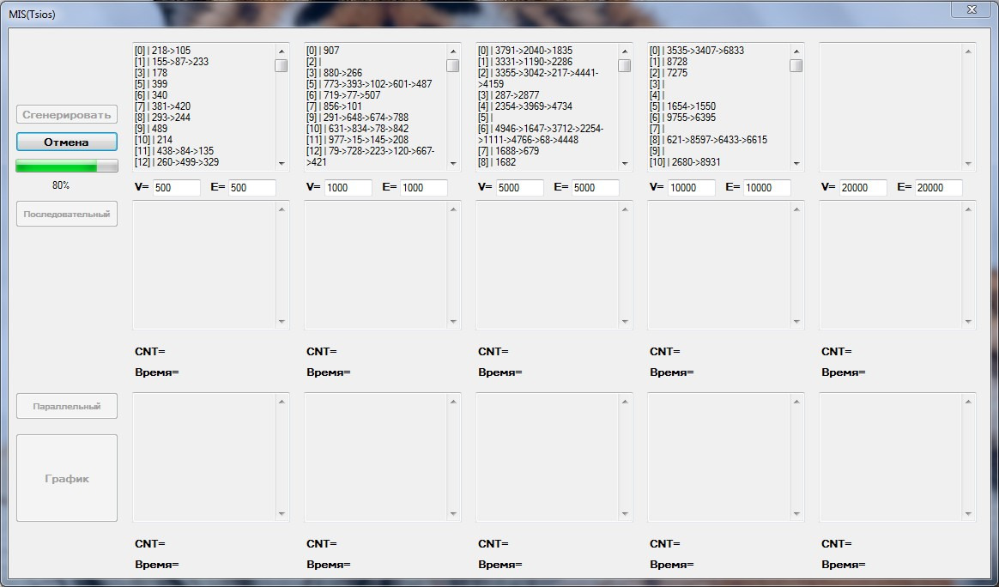
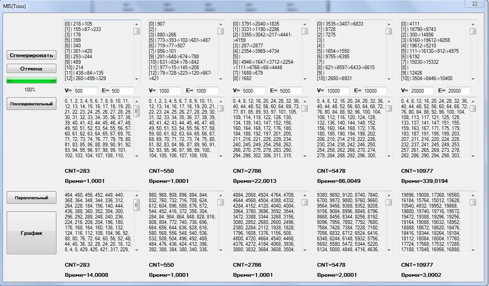
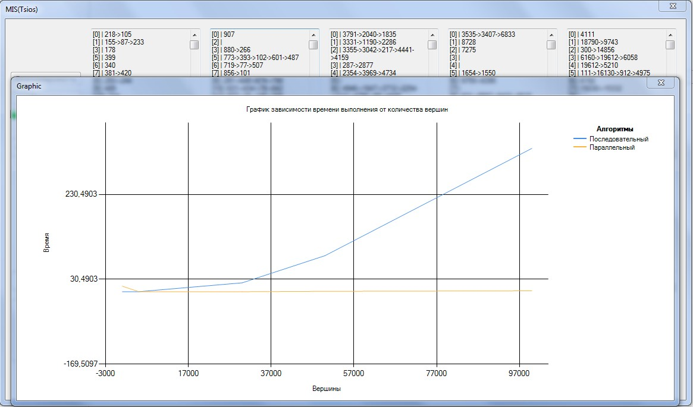

# MIS
#### Поиск наибольшего независимого множества

1.	Реализовать последовательный алгоритм поиска максимального независимого множества
2.	Реализовать параллельный алгоритм поиска максимального независимого множества
3.	Вывести содержимое списка смежности графов
4.	Вывести максимально независимые множества
5.	Нарисовать график
6.	Реализовать п.3-п.5, используя Windows Forms и Background Worker

#### Результатт
1.	Генерация графов с указанным числом ребер и вершин (до 5 шт. за раз)

2.	Поиск максимально независимых множеств для каждого графа из п.1 посредством параллельного или последовательного алгоритма

3.  Рисование графиков времени выполнения

